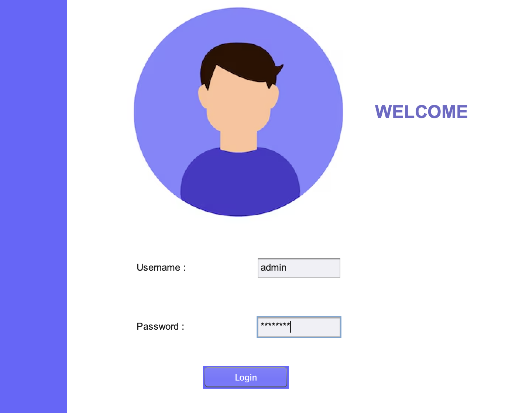
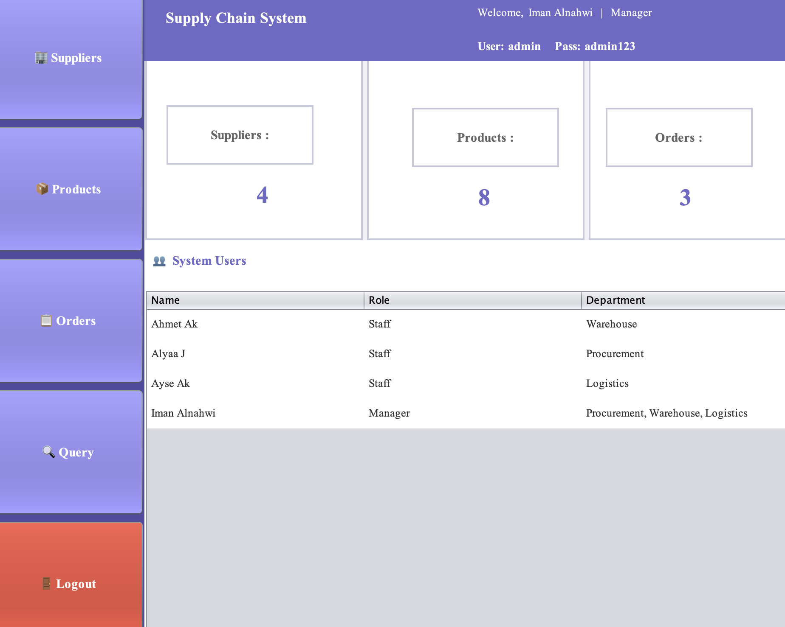
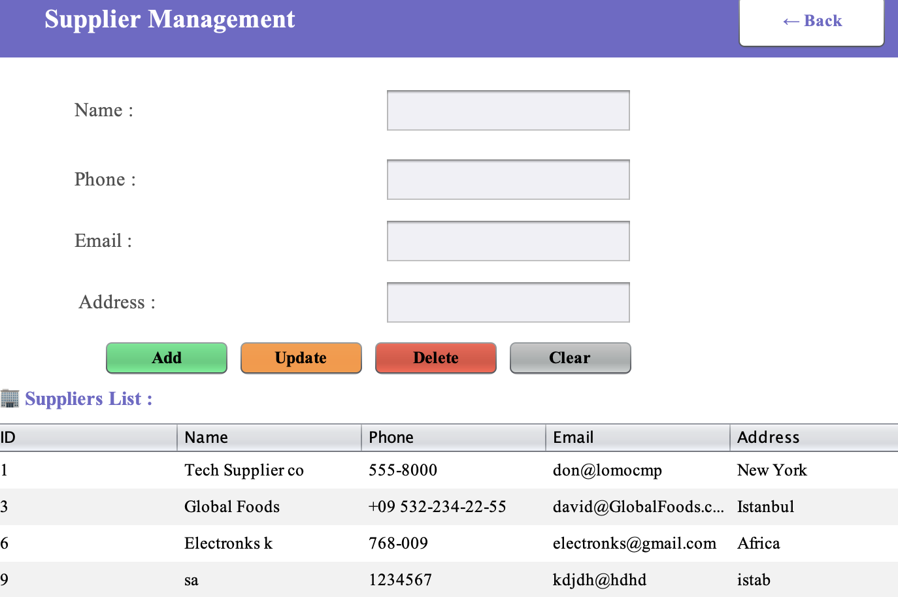
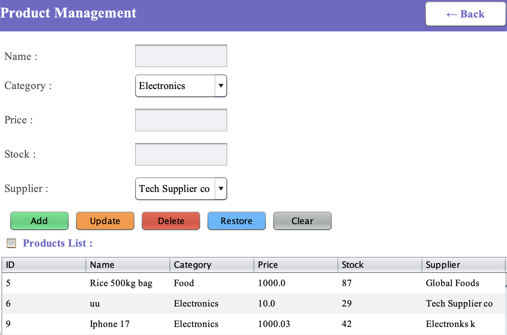
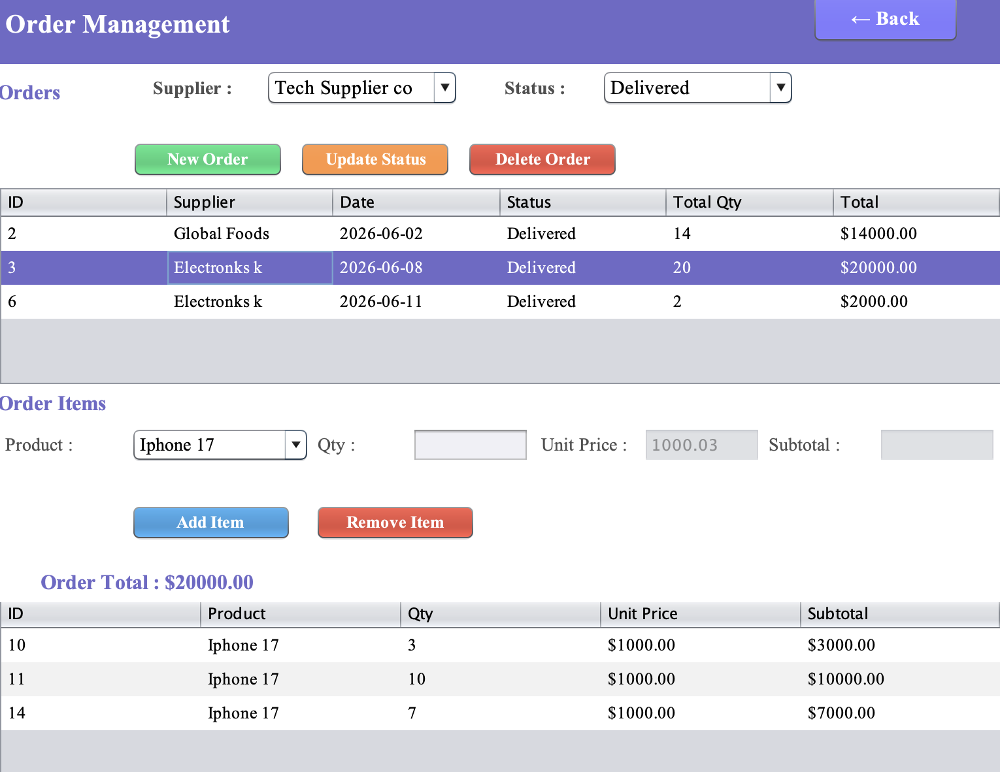
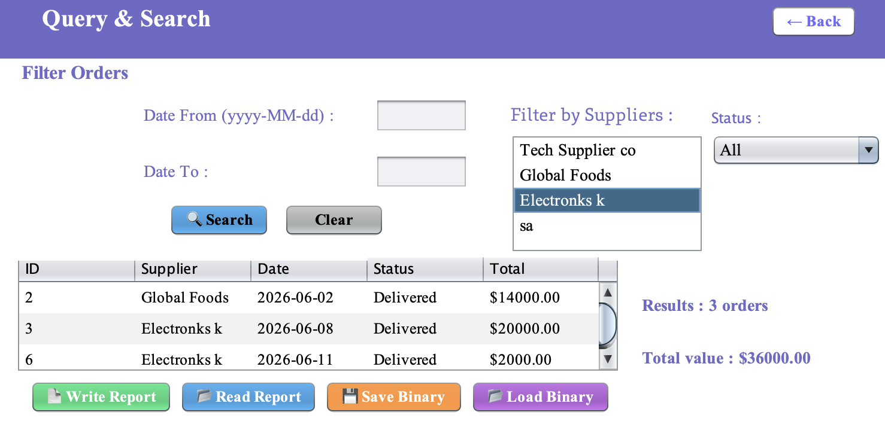
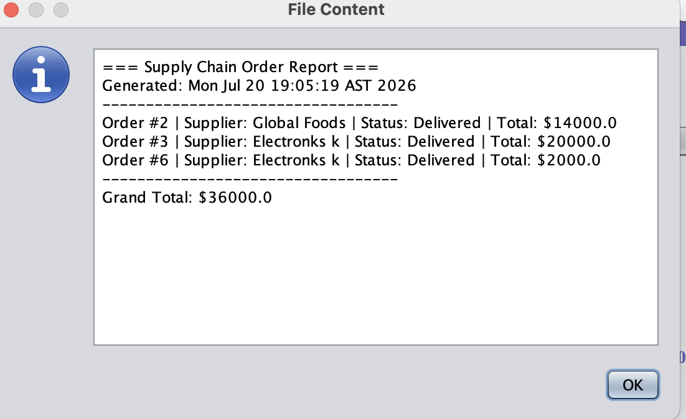
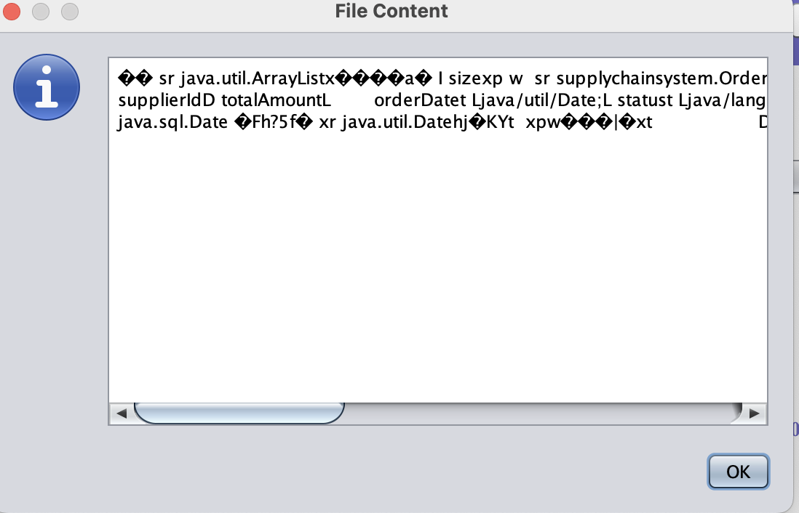

# Supply Chain Management System

A desktop application developed in Java to streamline supply chain operations by managing suppliers, products, and orders through an intuitive graphical interface. The system ensures secure data persistence and is built using strict Object-Oriented Programming (OOP) principles.

---

## 🚀 Features

* **Secure Authentication:** Professional login system with role-based access for administrators.
* **Supplier Management:** Full CRUD (Create, Read, Update, Delete) operations to track and manage supplier records.
* **Product & Order Tracking:** Efficient handling of supply items, product details, and order history.
* **Database Persistence:** Fully integrated with a relational MySQL database backend.
* **Intuitive UI:** User-friendly graphical interface built with Java Swing.

---

## 🛠️ Technologies Used

* **Language:** Java (JDK 21)
* **GUI Framework:** Java Swing (NetBeans GUI Builder)
* **Database:** MySQL & MySQL Workbench
* **IDE:** NetBeans IDE

---

## ⚙️ Setup & Installation

### 1. Database Setup
1. Open **MySQL Workbench**.
2. Import the provided `database_setup.sql` file.
3. Execute the script to create the necessary tables and schema.
4. Update the database connection settings in the project's source code (e.g., username, password, and URL) if your local MySQL setup differs from the default.

### 2. Running the Application
1. Clone this repository or download the project files.
2. Open the project in **NetBeans IDE**.
3. Resolve any missing database driver dependencies (ensure the MySQL JDBC driver is added to your libraries).
4. Run the project from the main class.

---

## 📸 System Screenshots & Interface Details

### Login Window

*The entry point where users type their credentials, containing a standard text box and a secure password box[cite: 1]. The system instantly alerts the user with an on-screen status message if the login data is incorrect[cite: 1].*

### Dashboard

*The main menu displaying the logged-in user's name and password[cite: 1]. It features automated count cards that summarize system data sizes and displays all active user accounts in a clean table view[cite: 1].*

### Supplier Management

*A data-entry workspace managed entirely by the JPA entity layer[cite: 1]. Clicking on any supplier row automatically loads its vendor information back into the form fields for fast editing or deletion[cite: 1].*

### Product Management

*Manages product listings using interactive dropdown combo boxes to select item categories and suppliers[cite: 1]. It includes a smart "Restore" action button to undo accidental inventory row deletions instantly[cite: 1].*

### Order Management

*The primary master-detail interface[cite: 1]. Selecting an order row from the top table (master) automatically updates the bottom table (detail) to display the explicit line items attached to that specific order[cite: 1].*

### Query & Search

*An analytics screen where users can search orders using component lists, status menus, and date boundaries[cite: 1]. It features dedicated buttons to save or load these search results to external text or binary backup files.*

### Text Report

*This feature utilizes Java's File API (`FileWriter`/`BufferedWriter`) to write and export human-readable, plain-text order reports complete with accurate timestamps and financial totals[cite: 1].*

### Binary Report

*This feature uses object serialization streams (`ObjectOutputStream`) to save the queried order list directly to a `.dat` backup file, allowing the exact data to be safely restored into system memory later[cite: 1].*

## 🔮 Future Improvements

* Export reports to PDF.
* Email notifications for low stock or new orders.
* Inventory analytics dashboard.
* Enhanced role-based permissions.

---

## 👩‍💻 Author

**Iman Alnahwi**
